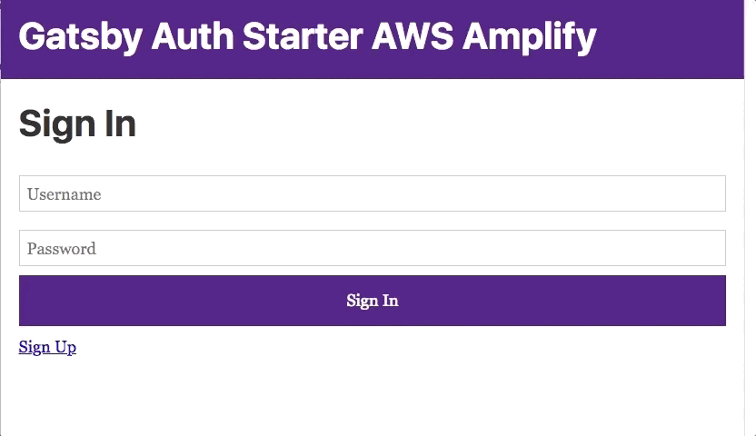

# Gatsby Auth starter with AWS Amplify

This auth starter implements a basic authentication flow for signing up signing in users as well as protected client side routing using [AWS Amplify](https://amplify.aws). Auth features:
- User sign up
- User sign in
- Multi-factor Authentication
- User sign-out




> Here, walk through the following steps:

- Enter a name for the project __YOURPROJECTNAME__
- Enter a name for the environment __master__
- Choose your default editor: __Visual Studio Code__ (or your editor of choice)
- Choose the type of app that you're building __javascript__
- What javascript framework are you using __react__
- Source Directory Path: __src__
- Distribution Directory Path: __public__
- Build Command: __npm run-script build__
- Start Command: __npm run-script develop__

6. Push the updated project configuration to AWS. It will deploy a CloudFormation template that has an Amazon Cognito resource that enables user authentication.

```sh
amplify push
```

7. Then you can run it by:
```sh
gatsby develop
```
